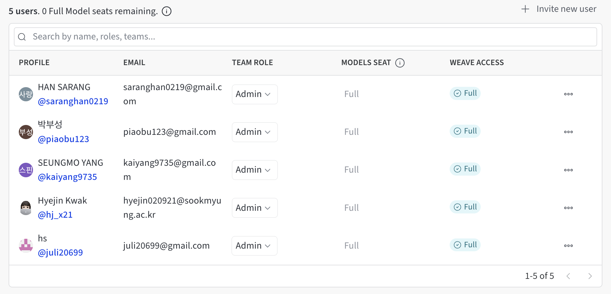
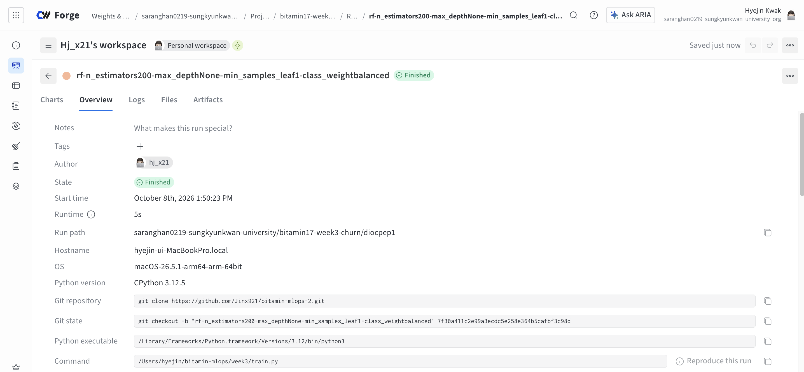
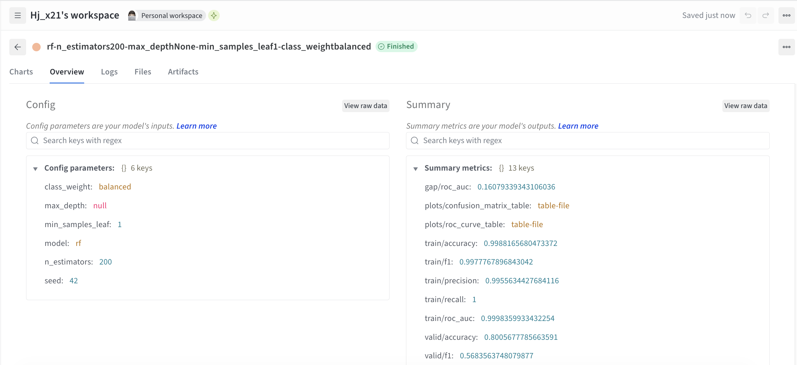
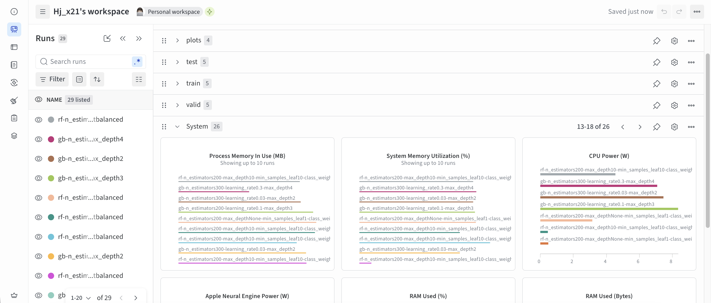
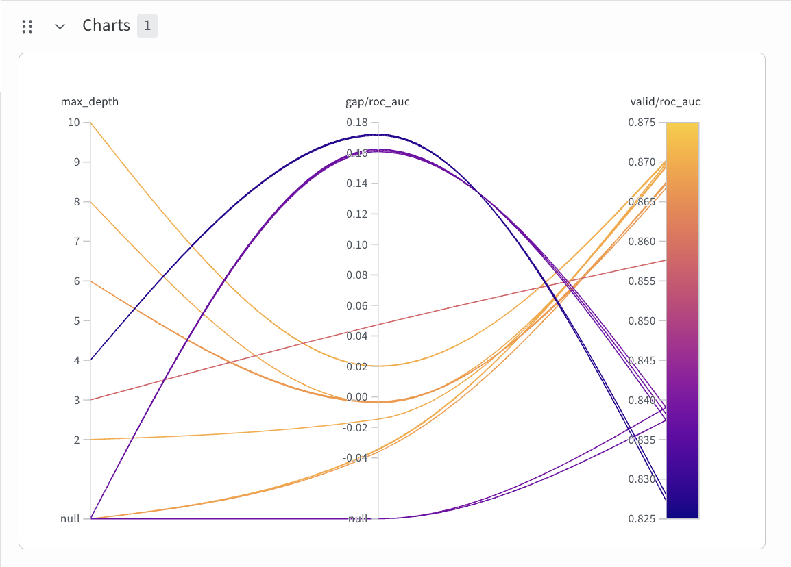
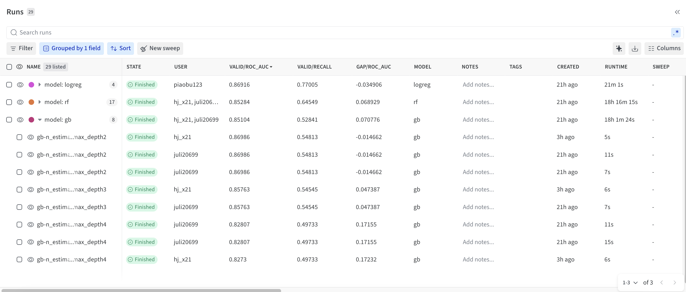
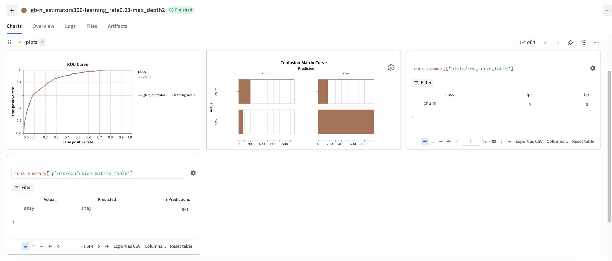
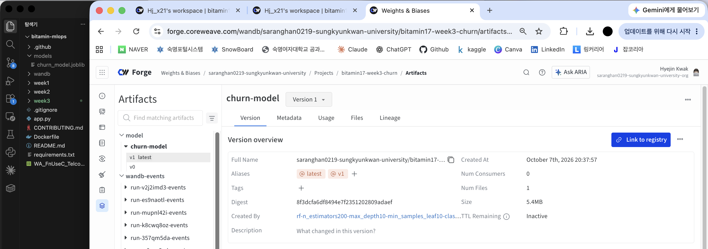

# 3주차 - W&B 실험 관리 실습 (hyejin 복습 과제)

2조 코드 `week3/train.py`로 W&B 실험 기록과 비교를 직접 재현하고 조가 정한 최종 모델을 `churn_model.joblib`과 W&B Artifact로 남겼습니다. 실험은 조원들과 같은 W&B 프로젝트 `bitamin17-week3-churn`에 기록했습니다. (작업 브랜치: `feature/wandb-hjk`, W&B ID: `hj_x21`)

## 출발 코드

| 파일                     | 내용                                         |
| ------------------------ | -------------------------------------------- |
| `week3/train.py`         | W&B 기록(STEP 1~4)이 추가된 조 학습 스크립트 |
| `week3/requirements.txt` | 3주차 패키지 버전 (`wandb==0.30.0` 포함)     |

```bash
python week3/train.py                                                                   # 첫 run (2주차 RF 설정)
python week3/train.py --model gb                                                        # C 실험 ①
python week3/train.py --model gb --learning_rate 0.03 --n_estimators 300 --max_depth 2  # C 실험 ②
python week3/train.py --model gb --learning_rate 0.3 --n_estimators 300 --max_depth 4   # C 실험 ③
python week3/train.py --model rf --max_depth 10 --min_samples_leaf 10 --save            # 최종 모델 저장
```

## 역할

| 담당           | 실험 모델                              | 주로 바꿔 볼 하이퍼파라미터                            |
| -------------- | -------------------------------------- | ------------------------------------------------------ |
| A              | Logistic Regression (`--model logreg`) | `--C`, `--class_weight`                                |
| B              | Random Forest (`--model rf`)           | `--max_depth`, `--min_samples_leaf`                    |
| **C (hyejin)** | **Gradient Boosting (`--model gb`)**   | **`--learning_rate`, `--n_estimators`, `--max_depth`** |
| D              | 평가·비교 (모델 자유)                  | 선택 기준(지표) 정리, 최종 모델 결정                   |

복습 과제에서는 C 역할을 맡아 Gradient Boosting 실험 3개를 진행했습니다.

## 체크포인트 (필수)

| 번호 | 내용                            | 통과 확인 화면                                                 |
| ---- | ------------------------------- | -------------------------------------------------------------- |
| 1    | 조별 W&B Team 생성 및 조원 초대 | Team 멤버 목록에 조원 전원                                     |
| 2    | 조원 전원이 첫 W&B run 기록     | 조 프로젝트 Runs 목록에 조원 수만큼 run                        |
| 3    | 조 전체 6개 이상 실험 비교      | 지표로 정렬한 Runs 표 + 비교 차트                              |
| 4    | 평가 그래프 기록                | 혼동행렬 · ROC 곡선 패널                                       |
| 5    | 최종 모델 저장                  | `models/churn_model.joblib` 저장 + `churn-model` Artifact 화면 |

## 막혔을 때

정답 코드는 `solution` 브랜치에 단계별 태그(`solution-step1` ~ `solution-step4`, `solution-final`)로 있습니다. 이번 복습에서는 이미 STEP 1~4가 반영된 조 `train.py`를 그대로 사용했습니다.

```bash
git fetch week3 --tags
git diff solution-step1 solution-step2               # STEP 1 → 2에서 바뀐 부분 보기
```

- 최종 모델을 `--save`로 저장했더니 `churn-model`의 새 버전(v2)이 생기지 않고 기존 `v1`에 연결되었습니다. 조원이 같은 조건과 같은 seed로 저장한 모델과 파일 내용이 완전히 같아서, W&B가 새 버전을 만들지 않고 기존 버전을 다시 사용한 것입니다.

API Key는 코드·README·커밋에 넣지 않습니다. `wandb login`으로만 인증합니다.

## Checkpoint 01



## Checkpoint 02







## Checkpoint 03





## Checkpoint 04



## Checkpoint 05


